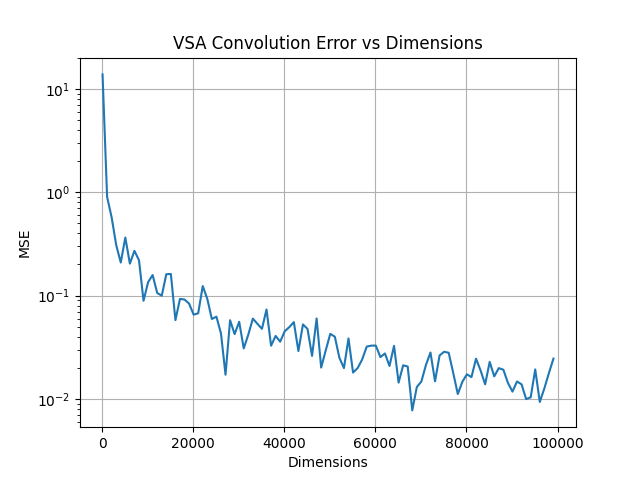

A demo how Vecto Symbolic Architecture (VSA) can approximate convolutions. See a very nice paper:
- Computing on Functions Using Randomized Vector Representations [[arxiv](https://arxiv.org/abs/2109.03429)]
- or my brief summarization [[pdf](https://anh-thh.github.io/misc/convolution_vsa.pdf)]

**Result**
<figure style="text-align:center; margin: 2rem 0;">
  
</figure>

TODO: 
- [ ] Generalize to Conv2d
- [ ] Generalize to high-dimensional in/ouput channels
- [ ] Learnable parameter
